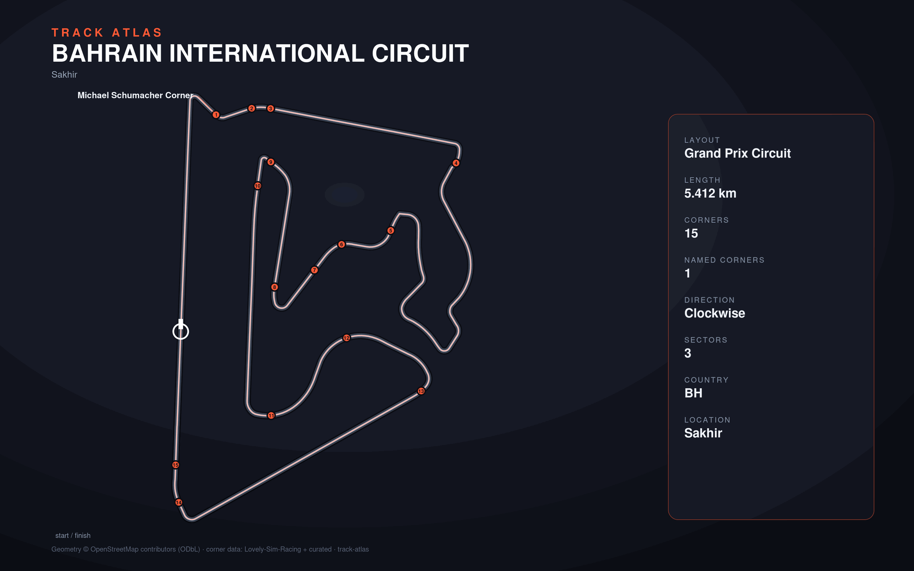

# Bahrain International Circuit

- **Layout**: Grand Prix Circuit (5412 m, clockwise)
- **Series**: wec, f1
- **Corners**: 15 (0 named); OSM name-match 0/15, 15 placed by centerline lap-fraction
- **Geometry**: OSM relation [11987743](https://www.openstreetmap.org/relation/11987743) centerline
- **Corner metadata**: Lovely-Sim-Racing `lmu/bahrain-international-circuit.json`

## Known gaps

- Official corner names not yet layered in (colloquial layer from Lovely only).
