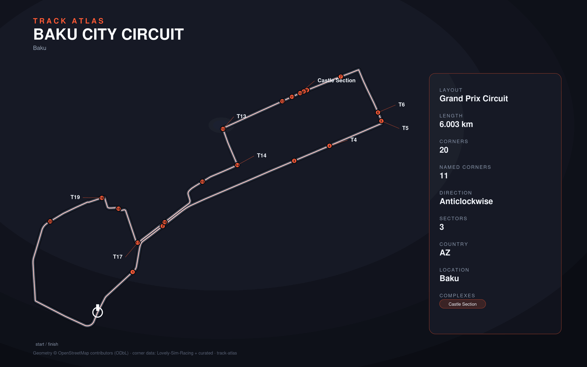

# Baku City Circuit

- **Layout**: Grand Prix Circuit (6003 m, anticlockwise)
- **Series**: f1
- **Corners**: 20 (20 named); OSM name-match 0/20, 20 placed by centerline lap-fraction
- **Geometry**: OSM relation [11266687](https://www.openstreetmap.org/relation/11266687) centerline
- **Corner metadata**: Lovely-Sim-Racing `f12025/baku-azerbaijan.json`

## Known gaps

- Official corner names not yet layered in (colloquial layer from Lovely only).
