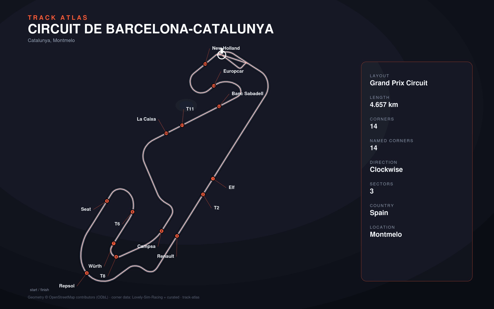

# Circuit de Barcelona-Catalunya

- **Layout**: Grand Prix Circuit (4657 m, clockwise)
- **Series**: elms, f1
- **Corners**: 14 (14 named); OSM name-match 0/14, 14 placed by centerline lap-fraction
- **Geometry**: OSM relation [284540](https://www.openstreetmap.org/relation/284540) centerline
- **Corner metadata**: Lovely-Sim-Racing `f12025/catalunya.json`

## Known gaps

- Official corner names not yet layered in (colloquial layer from Lovely only).
