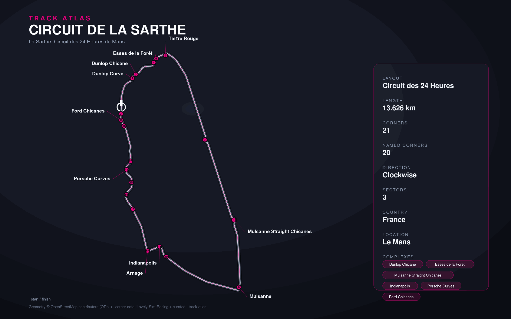

# Circuit de la Sarthe — Le Mans 24h



**Status: good.** Corner names (numbered / official / colloquial) complete and
curated; 14/21 corners pinned to real OSM coordinates.

- **Layout:** `24h` — Circuit des 24 Heures, 13.626 km, clockwise.
- **Country:** FR · **Centroid:** 47.95, 0.2247 · **Wikidata:** Q270760

## Data state

| field | state |
|-------|-------|
| corners (names) | ✅ 21/21 — all named across the 3 layers + complexes |
| corner coordinates | 🟡 14/21 from OSM named ways |
| pit entry/exit | ✅ from Lovely |
| sectors | ✅ 3 |
| slow zones | 🟡 35 zones in 9 sectors (zones lentes, 80 km/h, since 2014) — the official **count** is right; spans are evenly distributed (~390 m each) and labelled by section. Exact ACO signaller-post boundaries aren't public, so individual boundaries are approximate. |
| straights | ✅ incl. Hunaudières |
| outline geometry | 🟡 corner-trace (ordered named-corner points), not a full centerline |

## Known gaps / TODO

- **Mulsanne straight is public road (D338)** and only partly tagged
  `highway=raceway` in OSM, so the raceway ways sum to ~8.1 km of the 13.6 km
  lap. A precise full outline needs the D338 segments stitched in. Until then the
  outline is a faithful-but-coarse corner trace.
- **Indianapolis (T11)** is an unnamed segment in OSM → no coordinate yet (keeps
  its lap-fraction marker). Turns 3, 5, 10, 13, 19, 21 are unnamed kinks
  (numbered only), also without coordinates.

## Complexes

- **Dunlop** (T1–2) · **Mulsanne Straight Chicanes** (T7–8) ·
  **Indianapolis / Arnage** (T11–12) · **Porsche Curves** (T14–17) ·
  **Ford Chicanes** (T18–20)

## Regenerate

```bash
python scripts/import.py circuit-de-la-sarthe   # refresh raw/
python scripts/generate.py circuit-de-la-sarthe # rebuild track.json + layers/
```
