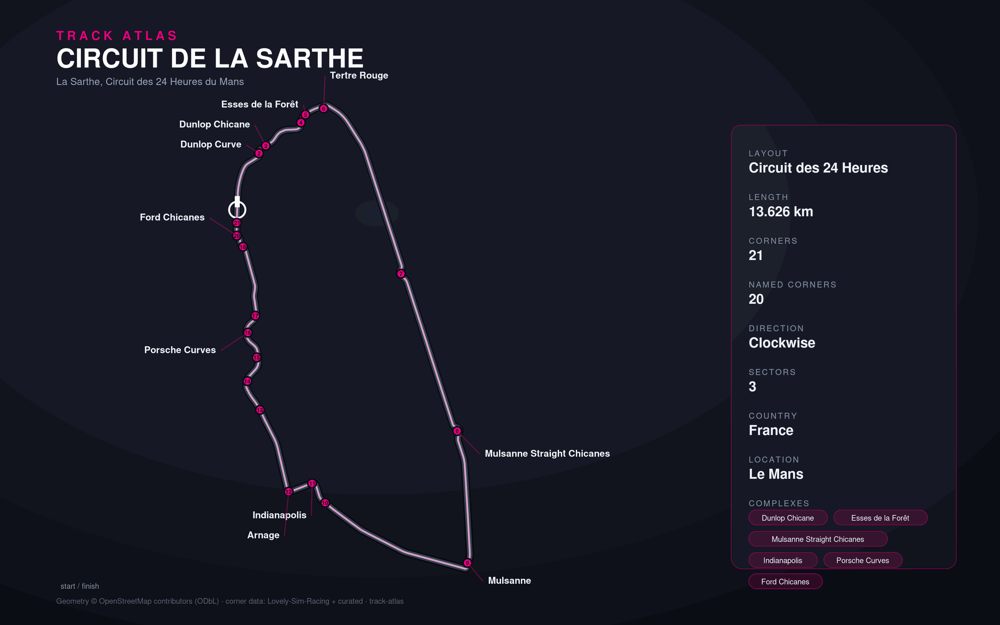

# Circuit de la Sarthe — Le Mans 24h



**Status: measured.** Track edges, midline and all 21 corners (entry / apex /
exit) measured from IGN open data at **1.44 m CE95** absolute, 0.15 m
relative.

- **Layout:** `24h` — Circuit des 24 Heures, 13.626 km, clockwise.
- **Country:** FR · **Centroid:** 47.95, 0.2247 · **Wikidata:** Q270760

## Data state

| field | state |
|-------|-------|
| corners (names) | ✅ 21/21 — all named across the 3 layers + complexes |
| corner coordinates | ✅ 21/21 placed on the measured curvature (apex, entry, exit) |
| pit entry/exit | ✅ from Lovely |
| sectors | ✅ 3 |
| slow zones | 🟡 9 zones (zones lentes, 80 km/h, since 2014) — the 9 driver-facing slow zones (the ACO further splits these into 35 marshalling sub-zones). Names/order are right; boundaries are anchored to the circuit's sections and approximate pending the official ACO map. |
| straights | ✅ incl. Hunaudières |
| outline geometry | ✅ measured midline + edges (BD ORTHO 2022 on LiDAR HD); the OSM relation (full lap incl. D338) is only the seed |

## Measured surface

- **Imagery** IGN BD ORTHO 2022 (20 cm, RGB + IRC; accuracy not stated by
  IGN). **Reference** IGN LiDAR HD (spec 0.50 m RMSE = 0.87 m CE95).
  **Datum** RGF93 -> ITRF2014 @ 2026.0 (0.92 m NE). The imagery sits 0.67 m from
  the lidar and the local shift varies 0.4-0.5 m around the lap (a mosaic of
  flights), so registration (1.15 m) dominates the 1.44 m budget; per-section
  registration is the way under 1 m. See docs/SOURCES.md.
- **Markers.** Lovely's LMU markers are rounded to 0.01 lap (136 m); T3-T5,
  T7, T8, T14, T15 and T18-T21 are pinned in `track.py` to the measured peaks
  (the chicanes each carry one number, on their entry apex; the other lobes are
  reviewed `part_of_corner`).
- **Bridges** (`t.bridge` in `track.py`): Tertre Rouge exit (a lane line), a
  lay-by on the Hunaudières, the Karting run-off, and two junctions before the
  Ford chicanes, where the imagery edge followed the wrong line.
- Model GT3 lap 229.97 s, 290 km/h top speed (no elevation).

## Known gaps / TODO

- The D338 / D140 public-road sections are measured as the full road width.
- Elevation (LiDAR HD has 0.10 m spec altimetry) is not yet used by the
  racing model.

## Complexes

- **Dunlop** (T1–2) · **Mulsanne Straight Chicanes** (T7–8) ·
  **Indianapolis / Arnage** (T11–12) · **Porsche Curves** (T14–17) ·
  **Ford Chicanes** (T18–20)

## Regenerate

```bash
python scripts/import.py circuit-de-la-sarthe   # refresh raw/
uv run python scripts/measure_surface.py circuit-de-la-sarthe  # network: IGN WMS + LiDAR HD
uv run python scripts/generate.py circuit-de-la-sarthe        # rebuild track.json + layers/
```
