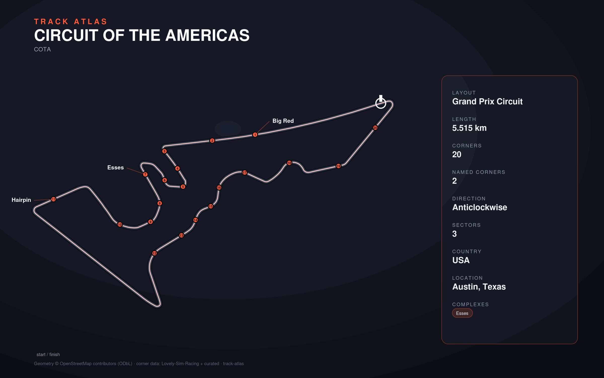

# Circuit of the Americas

- **Layout**: Grand Prix Circuit (5515 m, anticlockwise)
- **Series**: wec, f1
- **Corners**: 20 (0 named); OSM name-match 0/20, 20 placed by centerline lap-fraction
- **Geometry**: OSM relation [6537729](https://www.openstreetmap.org/relation/6537729) centerline
- **Corner metadata**: Lovely-Sim-Racing `lmu/circuit-of-the-americas.json`

## Known gaps

- Official corner names not yet layered in (colloquial layer from Lovely only).
