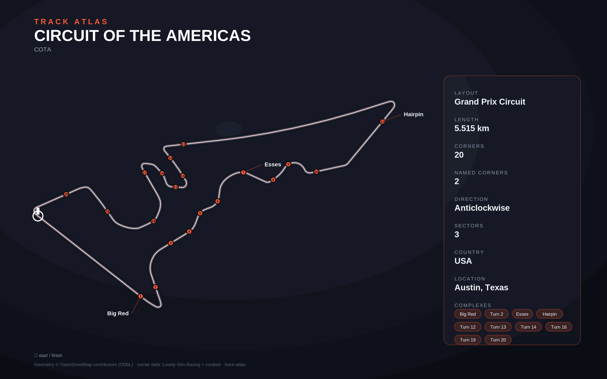

# Circuit of the Americas

- **Layout**: Grand Prix Circuit (5515 m, anticlockwise)
- **Series**: wec, f1
- **Corners**: 20 (0 named); OSM name-match 0/20, 20 placed by centerline lap-fraction
- **Geometry**: OSM relation [6537729](https://www.openstreetmap.org/relation/6537729) centerline
- **Corner metadata**: Lovely-Sim-Racing `lmu/circuit-of-the-americas.json`

## Curation notes

Evidence: TxGIO-measured midline curvature (`raw/surface-gp.json`), the OSM
relation 6537729 (its `role=finish` node and its 20 `Turn N` raceway ways,
one per corner), Lovely `lmu/circuit-of-the-americas.json` markers and
directions.

- **Lap origin.** The centerline began at the relation's `role=start` node,
  0.024 lap past the finish line, so every Lovely marker sat 90-190 m before
  its OSM `Turn N` way. T7 (left) therefore matched the second apex of T6 (a
  right) and verify reported a direction contradiction; t8, t13, t17 and t19
  found no peak. `source.json` `start_finish` is now the relation's
  `role=finish` node (13826373967). T7 was never mis-declared: OSM `Turn 7`
  holds a single left peak (R29, +78 deg), so its direction stays left.
- **Markers** set to the measured peak inside each OSM `Turn N` way (all within
  0.3 m of their peak now). Where a way holds two apexes, one is the marker
  and the other is reviewed as `part_of_corner`: T6 (first apex R89 at 0.2647,
  nearest the Lovely marker; second apex R65 at 0.2874), T15 (R47 at 0.7703; the R87
  first lobe at 0.7564 is below the review threshold), T17 (R53 at 0.8366,
  first apex R70 at 0.8171). T18 is the R64 peak at 0.8543 (its R81 second
  apex at 0.8770 is below the threshold).
- Directions from Lovely (lmu) agree with the geometry and the OSM ways for
  all 20 corners (T15 and T16 are both lefts, T17/T18 rights).

## Known gaps

- Official corner names are the numbers; the "Esses" complex on T3-T10 is
  from the earlier override, without a source (the esses are commonly T3-T6).
