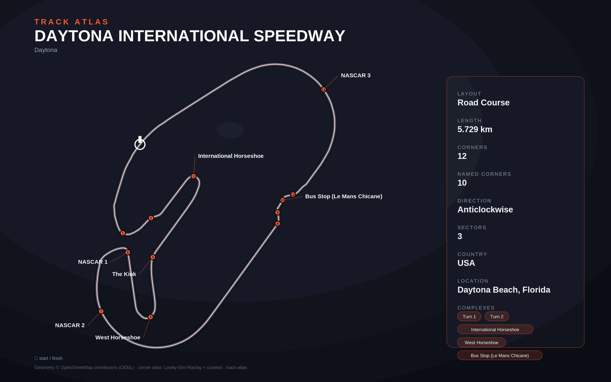

# Daytona International Speedway

- **Layout**: Road Course (5729 m, anticlockwise)
- **Series**: imsa
- **Corners**: 12 (12 named); OSM name-match 0/12, 12 placed by centerline lap-fraction
- **Geometry**: OSM relation [5254136](https://www.openstreetmap.org/relation/5254136) centerline
- **Corner metadata**: Lovely-Sim-Racing `iracing/daytona-2011-road.json`

## Known gaps

- Official corner names not yet layered in (colloquial layer from Lovely only).

## Curation notes

Evidence: NAIP-measured midline curvature (`raw/surface-gp.json`), the OSM
relation centerline, NAIP imagery crops. Unnamed-peak verdicts live in
`lap.unnamed(...)` calls in `track.py` (verify reports them as infos).

- **T5 West Horseshoe** was declared left. The measured midline turns right:
  R30.8 m, -186 deg total, apex on the right edge; the OSM centerline agrees
  (R33 right). Fixed to `right`; marker 0.309 is 4.5 m from the peak.
- **Unnamed peaks** (all R < 80 m, none is a missing numbered corner):

| frac | dir, R | verdict | evidence |
|---|---|---|---|
| 0.0515 / 0.0557 | L 52 / R 53 | artefact | +-20 deg pair at the pit-lane split (OSM pit way 0.054-0.059) |
| 0.069 | L 72 | part of T1 | +19 deg turn-in lobe, T1 apex R36 at 0.085 |
| 0.0996 / 0.1127 | L 65 / R 69 | unnumbered bends | +-25 deg flat bends between T1 and T2 |
| 0.4063 | L 38 | part of T6 | second left, merging onto the NASCAR 1 banking (imagery) |
| 0.5675 / 0.5714 | L 53 / R 57 | artefact | +-18 deg pair at the banking exit; OSM centerline R368/R775 |
| 0.7584 | L 57 | artefact | left edge jumps to the apron line; OSM centerline R196 |
| 0.8464 | L 66 | artefact | edge jump on the NASCAR 3-4 banking; OSM centerline R252 |

- T6 "NASCAR 1" is a R25 m, +105 deg infield left (scale 5 in Lovely looks
  too fast); left as-is pending a driver source.
