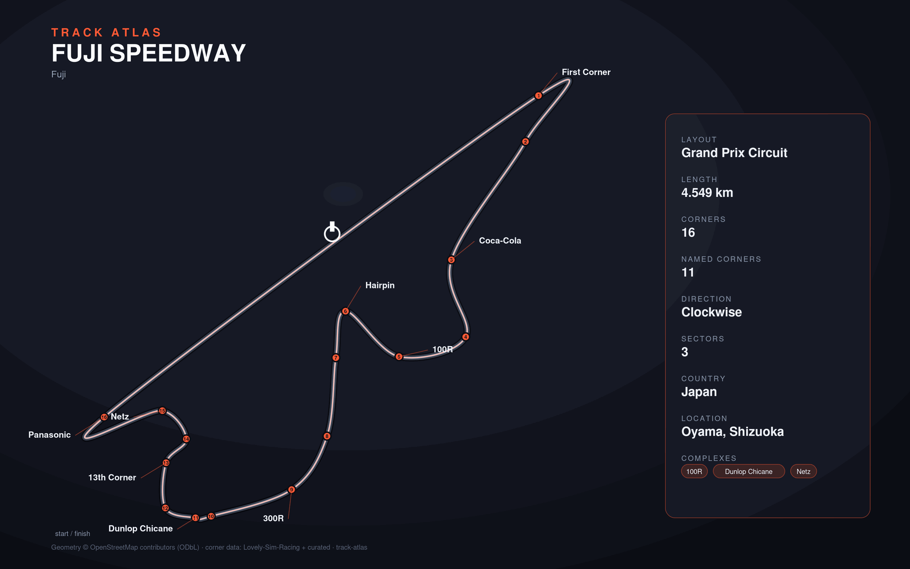

# Fuji Speedway

- **Layout**: Grand Prix Circuit (4549 m, clockwise)
- **Series**: wec
- **Corners**: 16 (9 named); OSM name-match 0/16, 0 placed by centerline lap-fraction
- **Geometry**: stitched from `highway=raceway` ways in the bbox (no OSM route relation found)
- **Corner metadata**: Lovely-Sim-Racing `lmu/fuji-speedway.json`

## Known gaps

- Official corner names not yet layered in (colloquial layer from Lovely only).
- No OSM route/circuit relation; outline quality depends on bbox way coverage.
