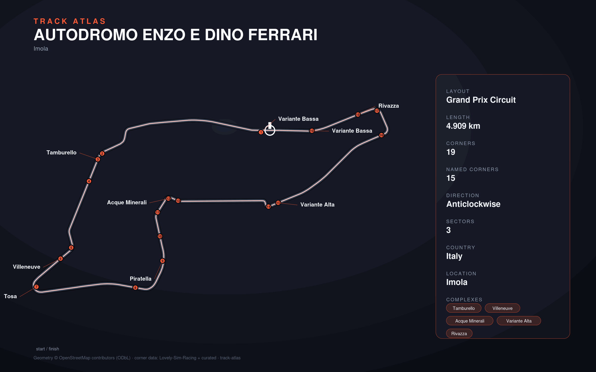

# Autodromo Enzo e Dino Ferrari

- **Layout**: Grand Prix Circuit (4909 m, anticlockwise)
- **Series**: wec, elms, f1
- **Corners**: 19 (8 named); OSM name-match 7/19, 12 placed by centerline lap-fraction
- **Geometry**: OSM relation [9291096](https://www.openstreetmap.org/relation/9291096) centerline
- **Corner metadata**: Lovely-Sim-Racing `lmu/autodromo-enzo-e-dino-ferrari.json`

## Known gaps

- Official corner names not yet layered in (colloquial layer from Lovely only).
