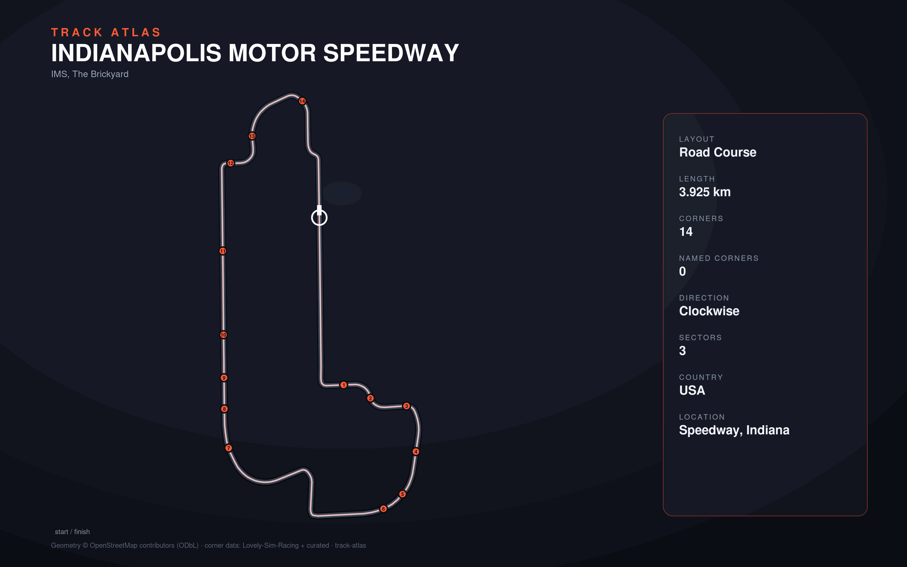

# Indianapolis Motor Speedway

- **Layout**: Road Course (3925 m, clockwise)
- **Series**: imsa
- **Corners**: 14 (14 named); OSM name-match 0/14, 0 placed by centerline lap-fraction
- **Geometry**: OSM relation [20573734](https://www.openstreetmap.org/relation/20573734) centerline
- **Corner metadata**: Lovely-Sim-Racing `iracing/indianapolis-2022-road.json`

## Known gaps

- Official corner names not yet layered in (colloquial layer from Lovely only).
