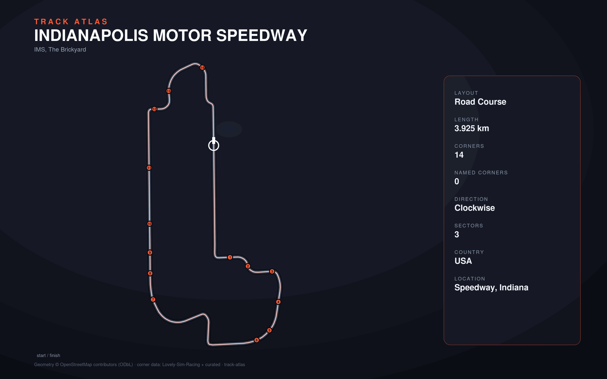

# Indianapolis Motor Speedway

- **Layout**: Road Course (3925 m, clockwise)
- **Series**: imsa
- **Corners**: 14 (14 named); OSM name-match 0/14, 0 placed by centerline lap-fraction
- **Geometry**: OSM relation [20573734](https://www.openstreetmap.org/relation/20573734) centerline
- **Corner metadata**: Lovely-Sim-Racing `iracing/indianapolis-2022-road.json`

## Curation notes

Front straight / T1 entry (0.10-0.167): the pit-exit lane merges beside the
straight without a painted line and the oval continues past road-course T1, so
the imagery edges wandered onto the pit lane (right) and the oval (left) and
put a false right-left wiggle into the midline. Both edges are bridged there by
`t.bridge(...)` calls in `track.py` (reported in `unseen_spans`); the midline is now
straight within 0.5 m to 0.13 and tapers ~2.6 m into the T1 turn-in.

Corner directions are still unset (the Lovely iracing source has none); the
measured direction is in each corner's `placement.direction`.

## Known gaps

- Official corner names not yet layered in (colloquial layer from Lovely only).
