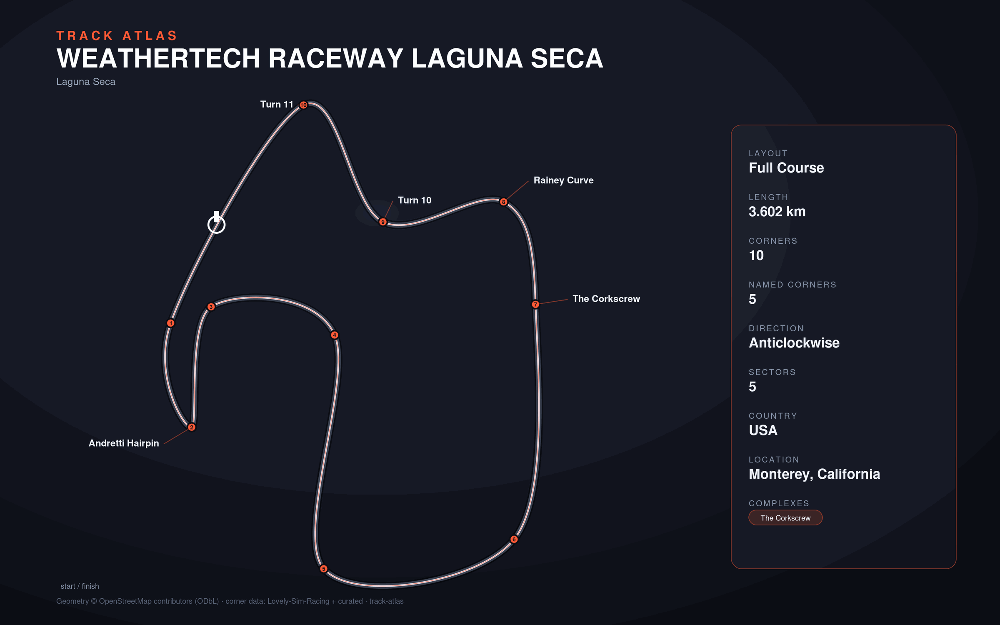

# WeatherTech Raceway Laguna Seca

- **Layout**: Full Course (3602 m, anticlockwise)
- **Series**: imsa
- **Corners**: 10 (10 named); OSM name-match 2/10, 0 placed by centerline lap-fraction
- **Geometry**: stitched from `highway=raceway` ways in the bbox (no OSM route relation found)
- **Corner metadata**: Lovely-Sim-Racing `iracing/lagunaseca.json`

## Known gaps

- Official corner names not yet layered in (colloquial layer from Lovely only).
- No OSM route/circuit relation; outline quality depends on bbox way coverage.
