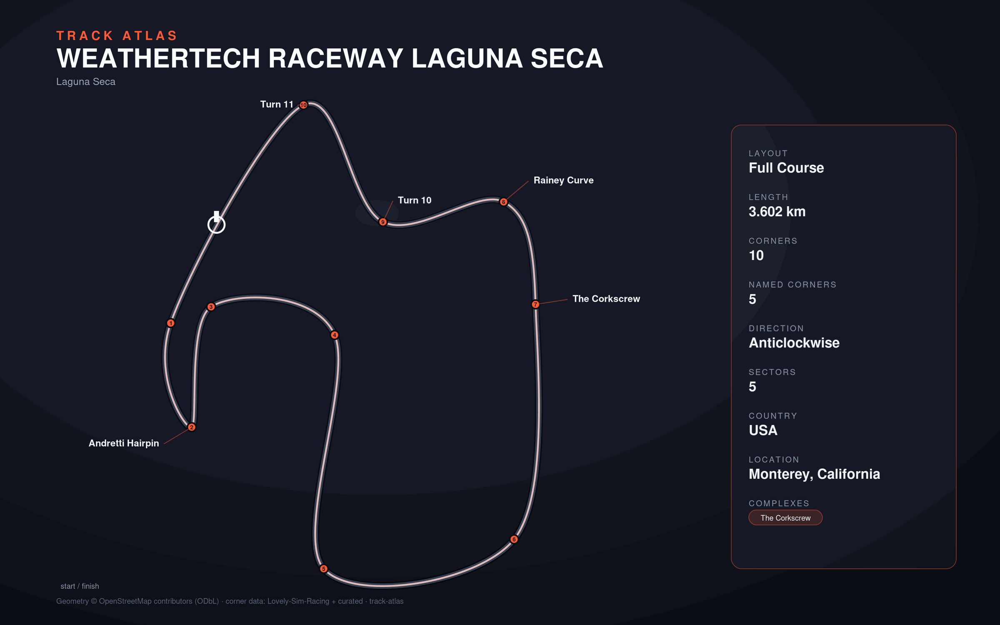

# WeatherTech Raceway Laguna Seca

- **Layout**: Full Course (3602 m, anticlockwise)
- **Series**: imsa
- **Corners**: 10 (10 named); OSM name-match 2/10, 0 placed by centerline lap-fraction
- **Geometry**: stitched from `highway=raceway` ways in the bbox (no OSM route relation found)
- **Corner metadata**: Lovely-Sim-Racing `iracing/lagunaseca.json`

## Curation notes

Evidence: measured midline curvature (`raw/surface-gp.json`), the stitched OSM
centerline and its named ways (Andretti Hairpin, Rahal Straight, The
Corkscrew 0.674-0.711, Rainey Curve 0.745-0.772), Lovely
`iracing/lagunaseca.json` ranges (names, no markers or directions).

Lovely lists 10 corners and folds the Corkscrew into one, so from the
Corkscrew on the numbered labels ran one short of the circuit's (7 for the
Corkscrew, 8 for Rainey Curve), and verify flagged three unnamed peaks there.
Replaced with the 12 measured corners (`replace_corners`, markers on the
peaks, each within 0.1 m):

| # | code | dir | marker | measured peak | was |
|---|---|---|---|---|---|
| 1-6 | 1-6 | L L R R L L | 0.0669 / 0.1452 / 0.2195 / 0.2959 / 0.4298 / 0.5419 | as before | markers 5-31 m off |
| 7 | 7 | R | 0.6541 | R47, -35 deg; centerline bends right too (R124) | missing (unnamed peak) |
| 8 | 8 | L | 0.6856 | R19, +100 deg; OSM The Corkscrew way | labelled Turn 7 |
| 9 | 8A | R | 0.6963 | R24, -90 deg; OSM The Corkscrew way | missing (unnamed peak) |
| 10 | 9 | L | 0.7706 | R40, +118 deg; OSM Rainey Curve way | labelled Turn 8, marker 48 m off |
| 11 | 10 | R | 0.8360 | R44, -78.5 deg | labelled Turn 9 |
| 12 | 11 | L | 0.9130 | R17, +118.5 deg | labelled Turn 10 |

T7 is a right in the measured geometry, where the old override's note
expected a left kink. The one left peak there (L48 at 0.6477) has its left
edge seen on 10% of it, and the centerline turns right there. It is reviewed
as an artefact, as is the R76 at 0.7977, which sits where the centerline is
straight (`gp.surface_review`). `start_finish` is pinned at the unchanged
stitched origin so the curated markers stay on this frame.

## Known gaps

- Official names only for the named corners (Andretti Hairpin, Corkscrew, Rainey Curve).
- No OSM route/circuit relation; outline quality depends on bbox way coverage.
