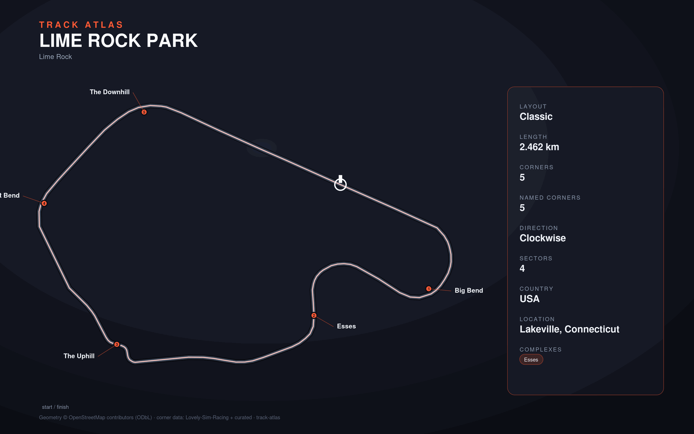

# Lime Rock Park

- **Layout**: Classic (2462 m, clockwise)
- **Series**: imsa
- **Corners**: 5 (5 named); OSM name-match 3/5, 0 placed by centerline lap-fraction
- **Geometry**: OSM relation [6429257](https://www.openstreetmap.org/relation/6429257) centerline
- **Corner metadata**: Lovely-Sim-Racing `iracing/limerock-2019-classic.json`

## Known gaps

- Official corner names not yet layered in (colloquial layer from Lovely only).
