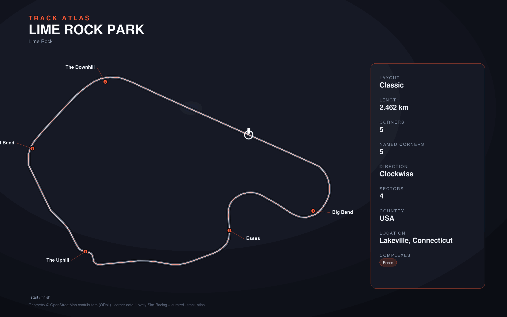

# Lime Rock Park

- **Layout**: Classic (2462 m, clockwise)
- **Series**: imsa
- **Corners**: 5 (5 named); OSM name-match 3/5, 0 placed by centerline lap-fraction
- **Geometry**: OSM relation [6429257](https://www.openstreetmap.org/relation/6429257) centerline
- **Corner metadata**: Lovely-Sim-Racing `iracing/limerock-2019-classic.json`

## Curation notes

Evidence: measured midline curvature (`raw/surface-gp.json`), the OSM raceway
ways with their `ref` turn numbers (Big Bend 1 and 2, The Lefthander 3, The
Righthander 4, Climbing Turn / "The Uphill" 5, West Bend 6, Diving Turn /
"Downhill" 7), Lovely `iracing` ranges.

Lovely had five corners. It folded Big Bend's two apexes into one and left
out the Righthander, and three of its markers sat 74-88 m from their peaks.
Replaced with the seven OSM-numbered turns, each marker on its measured peak
(within 0.1 m):

| # | name | dir | marker | measured peak | was |
|---|---|---|---|---|---|
| 1 | Big Bend | R | 0.0928 | R58, -97 deg; OSM Big Bend ref 1 | unnamed peak |
| 2 | Big Bend | R | 0.1808 | R57, -90 deg; OSM Big Bend ref 2 | T1, marker 77 m off |
| 3 | The Lefthander | L | 0.2776 | R46.5, +125 deg; OSM ref 3 | T2, marker 74 m off |
| 4 | The Righthander | R | 0.3242 | R54, -72 deg; OSM ref 4 | unnamed peak |
| 5 | Climbing Turn (The Uphill) | R | 0.4993 | R19, -80 deg | T3 on the chicane exit at 0.5287 |
| 6 | West Bend | R | 0.6550 | R53, -69 deg; OSM ref 6 | T4, marker 88 m off |
| 7 | Diving Turn (The Downhill) | R | 0.7916 | R79, -67 deg; OSM ref 7 | T5, marker 75 m off |

Unresolved: the centerline is the OSM relation "Lime Rock Park (with
Chicane)". Between 0.4950 and 0.5889 it takes the `South Chicane` way instead
of the second `Climbing Turn` way. The two share endpoints and run up to 24 m
apart. Its L21 / R30.5 peaks (0.5125, 0.5287) and the R76 rejoin bend (0.5874)
are reviewed as belonging to that branch (`gp.surface_review`), and T5 sits
on the branch's first right. The non-chicane lap (Climbing Turn + West Bend)
would be about 2371 m. The declared 2462 m matches neither, hence the length
warning. The stitched candidate (2411 m) takes the West Chicane instead, so
it is not the fix either. Fixing this needs a centerline built from the
Climbing Turn way and the surface re-measured on it.

## Known gaps

- Centerline takes the South Chicane branch (see Curation notes).
