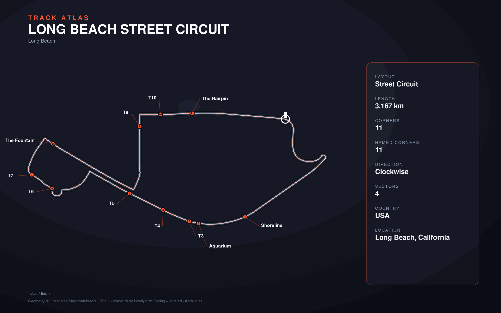

# Long Beach Street Circuit

- **Layout**: Street Circuit (3167 m, clockwise)
- **Series**: imsa
- **Corners**: 11 (11 named); OSM name-match 0/11, 11 placed by centerline lap-fraction
- **Geometry**: OSM relation [18052024](https://www.openstreetmap.org/relation/18052024) centerline
- **Corner metadata**: Lovely-Sim-Racing `iracing/longbeach.json`

## Known gaps

- Official corner names not yet layered in (colloquial layer from Lovely only).
