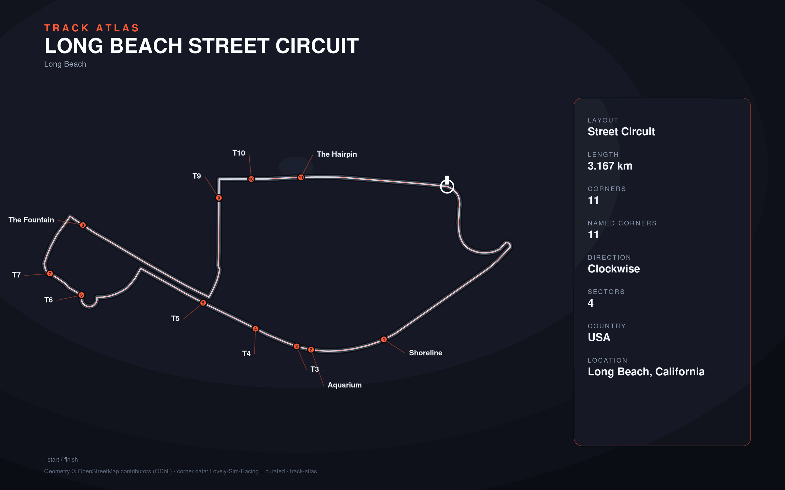

# Long Beach Street Circuit

- **Layout**: Street Circuit (3167 m, clockwise)
- **Series**: imsa
- **Corners**: 11 (11 named); OSM name-match 0/11, 11 placed by centerline lap-fraction
- **Geometry**: OSM relation [18052024](https://www.openstreetmap.org/relation/18052024) centerline
- **Corner metadata**: Lovely-Sim-Racing `iracing/longbeach.json`

## Curation notes

Evidence: NAIP-measured midline curvature (`raw/surface-gp.json`), the OSM
relation centerline and its named ways ("Grand Prix of Long Beach Hairpin"),
Lovely `iracing/longbeach.json` apex markers.

- **Lap origin.** The OSM relation starts 0.212 lap before the start line, so
  every Lovely marker sat on the wrong corner (T2 had no peak at all, T1 matched
  a R113 bend). Measured: Lovely T1 0.223 vs the first tight peak at 0.4366,
  Lovely T11 0.882 vs the hairpin peak / OSM Hairpin way at 0.0928; both +0.212.
  `track.py`'s `start_finish` kwarg now sits on Shoreline Drive 390 m after the
  hairpin, and all 11 Lovely markers land within 21 m of a measured peak with
  no per-corner marker overrides.
- **Directions** re-set from the measured peaks: T1 L (R17, +83 deg), T2 R (R20,
  -117), T3 L (R30, +37), T4 R (R26.5, -79), T5 R (R14.6, -99), T6 L (R15.7,
  +104), T7 L (R65, +16), T8 R (R16, -88.5), T9 R (R32, -87), T10 L (R43, +75),
  T11 R (R11.5, -179, the hairpin). The old override had T1-T6 and T8 the other
  way round. Scales re-set from those radii.
- **Names.** Lovely has only numbers. "Shoreline", "Aquarium" and "The Fountain"
  in the old override had no source and "Aquarium" / "Fountain" sat on corners
  nowhere near those landmarks, so `driver` is cleared (display falls back to
  "Turn N"). "The Hairpin" stays on T11 (OSM Hairpin way).
- **Unnamed peaks reviewed** (`lap.unnamed(...)` in `track.py`): R73 at
  0.2442 and L24.5 at 0.2675 are real bends between T1 and T2 (the OSM
  centerline bends there too) but unnumbered; L78 at 0.7647 is an edge artefact
  (centerline straight); L55 at 0.8693 is the second lobe of T10 before the
  hairpin.
- Pit entry/exit: OSM has no pit-lane way here, so none is placed.

## Known gaps

- No official corner names beyond numbers; no pit-lane geometry in OSM.
