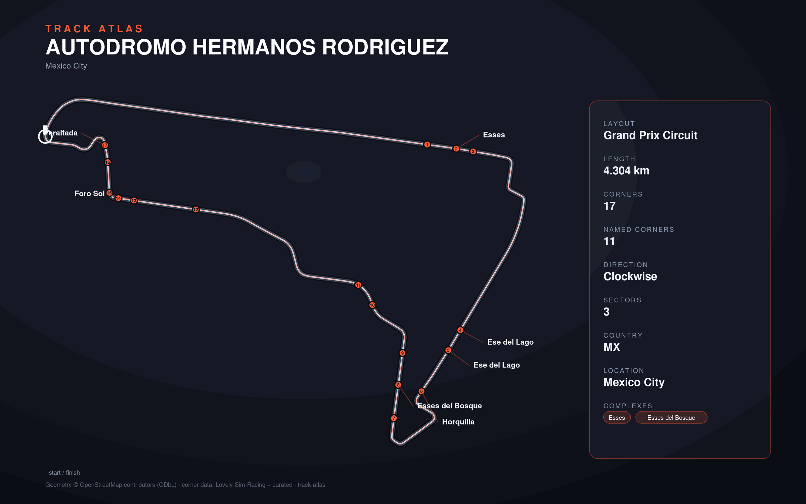

# Autodromo Hermanos Rodriguez

- **Layout**: Grand Prix Circuit (4304 m, clockwise)
- **Series**: f1
- **Corners**: 17 (17 named); OSM name-match 0/17, 17 placed by centerline lap-fraction
- **Geometry**: OSM relation [16251935](https://www.openstreetmap.org/relation/16251935) centerline
- **Corner metadata**: Lovely-Sim-Racing `f12025/mexico.json`

## Known gaps

- Official corner names not yet layered in (colloquial layer from Lovely only).
