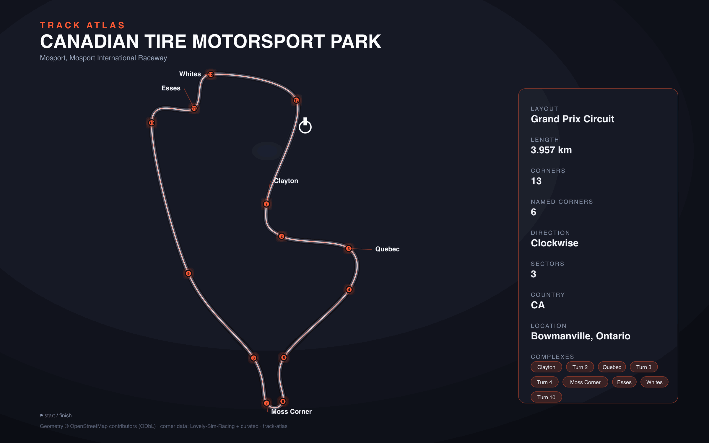

# Canadian Tire Motorsport Park

- **Layout**: Grand Prix Circuit (3957 m, clockwise)
- **Series**: imsa
- **Corners**: 13 points (10 turns with sub-apexes 2/2A, 5/5C, 9A/9B); 5 named; OSM name-match 6/13
- **Geometry**: stitched from `highway=raceway` ways in the bbox (no OSM route relation found)
- **Corner metadata**: IMSA 2026 Timing All Sections Map + Track Map (official turn numbering), OSM named ways (Clayton Corner, Quebec Corner, Moss Corner, Esses, Whites Corner), curvature_apexes for marker refinement

## Corner list

| # | Code | Name | Dir | Scale |
|---|------|------|-----|-------|
| 1 | 1 | Clayton Corner | L | 3 |
| 2 | 2 | — | L | 3 |
| 3 | 2a | Quebec Corner | R | 2 |
| 4 | 3 | — | R | 3 |
| 5 | 4 | — | L | 3 |
| 6 | 5 | Moss Corner | R | 1 |
| 7 | 5c | — | R | 1 |
| 8 | 6 | — | L | 5 |
| 9 | 7 | — | R | 6 |
| 10 | 8 | Esses | R | 3 |
| 11 | 9a | Esses | L | 2 |
| 12 | 9b | Whites Corner | R | 2 |
| 13 | 10 | — | R | 4 |

## Known gaps

- No Lovely-Sim-Racing data exists for Mosport/CTMP; corner list built from IMSA
  official timing/track maps + OSM named ways instead.
- Turns 6 and 7 are gentle kinks on the Mario Andretti Straight; they are too
  gradual for curvature-based apex detection (flagged by check_apexes as far
  from κ peaks) but are part of the official 10-turn numbering.
- Turn 10 is an unnamed fast sweeper on the front straight whose apex sits just
  before the start/finish line.
- Start/finish pinned from the IMSA timing section S01 (S/F → Pit Out = 161 m,
  Pit Out at the OSM pit-lane exit vertex), placing S/F inside the front-straight
  sweeper exit — verified by the official section lengths summing to 3957 m.
