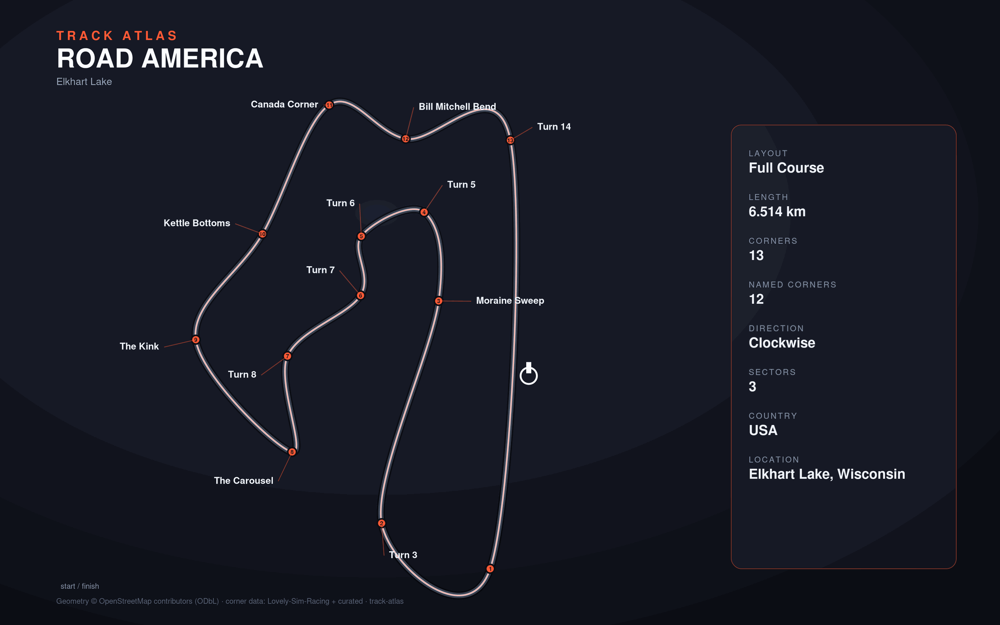

# Road America

- **Layout**: Full Course (6514 m, clockwise)
- **Series**: imsa
- **Corners**: 14 (official numbering, OSM `ref=1..14`); curated with `lap.corners([...])` in `track.py`
- **Geometry**: stitched from `highway=raceway` ways in the bbox (no OSM route relation found)
- **Corner metadata**: Lovely-Sim-Racing `iracing/roadamerica-full.json`

## Known gaps

- No OSM route/circuit relation; outline quality depends on bbox way coverage.
- Lap origin is pinned from marker/geometry agreement, not a surveyed timing line.
- No measured surface (NAIP surface not run for this track).

## Curation notes

Evidence: OSM centerline curvature (sigma 12 m, `/scripts/check_apexes.py`),
OSM `highway=raceway` ways (all `oneway=yes`, 14 of them carry `ref=1..14`),
Lovely `iracing/roadamerica-full.json`. Fractions below are on the emitted
centerline (6,438 m) after the start/finish pin.

- **Centerline.** The stitched lap used to run the oneway Canada Corner way
  backwards between two 64 m join chords (vertices ~249-264): +128 m and a fake
  360 deg loop (R11 m peaks). `lib/osm.stitch_circuit_ways` now penalises gap
  joins that reverse direction (>120 deg onto/off the chord). The lap is now
  6,438 m (declared 6,514 m, -1.2 %); it also follows the T1, T5 and T14 arcs
  where the old one cut chords.
- **Start/finish.** The OSM-alignment origin put every Lovely marker 0.0148 lap
  (mean of 10 corners, sd ~13 m, ~95 m) after its curvature peak. A per-corner
  "button lag" would scale with speed; a constant shift is an origin error, so
  `track.py`'s `start_finish` kwarg pins start/finish 96 m further north on the front straight.
- **Numbering.** Lovely has 13 corners and misses T2, T4 and T9; names were
  shifted ("Turn 3" on T2, "Moraine Sweep"/"Turn 5" on the straight, a "Turn
  14" duplicate). Replaced with the 14 OSM `ref` turns:

| # | dir | marker | κ peak (R, turn) | OSM way (ref) | note |
|---|---|---|---|---|---|
| 1 | R | 0.1008 | R75, -79 deg | ref 1 | |
| 2 | R | 0.1445 | R305, -6 deg | ref 2 | flat kink, scale 6 |
| 3 | R | 0.1702 | R55, -95 deg | ref 3 | was declared left |
| 4 | R | 0.2459 | R~1000, ~-9 deg | ref 4 | no curvature apex (flat bend): the one remaining verify warning, expected |
| 5 | L | 0.3553 | R28, +99 deg | ref 5 | end of Moraine Sweep (a section, not a corner) |
| 6 | L | 0.4007 | R39, +90 deg | ref 6 | was declared right |
| 7 | R | 0.4392 | R71, -54 deg | ref 7 | was declared left |
| 8 | L | 0.5027 | R35, +87 deg | ref 8 | end of Hurry Downs |
| 9 | R | 0.5333 | R104, -123 deg | Carousel, ref 9 | was missing |
| 10 | R | 0.5847 | R103, -80 deg | Carousel, ref 10 | |
| 11 | R | 0.6601 | R85, -47 deg | Kink, ref 11 | was declared left |
| 12 | R | 0.7901 | R43, -89 deg | Canada Corner, ref 12 | was declared left |
| 13 | L | 0.8367 | R96, +58 deg | ref 13 | Lovely name Bill Mitchell Bend |
| 14 | R | 0.8903 | R55, -95 deg | ref 14 | |

  Kettle Bottoms (OSM way between T11 and T12) and Thunder Valley (between
  T12 and T13) are straight sections (only +-5-8 deg wiggles, R>250 m), so the
  Lovely "Kettle Bottoms" corner was dropped. Scales are from radius/turn angle.
