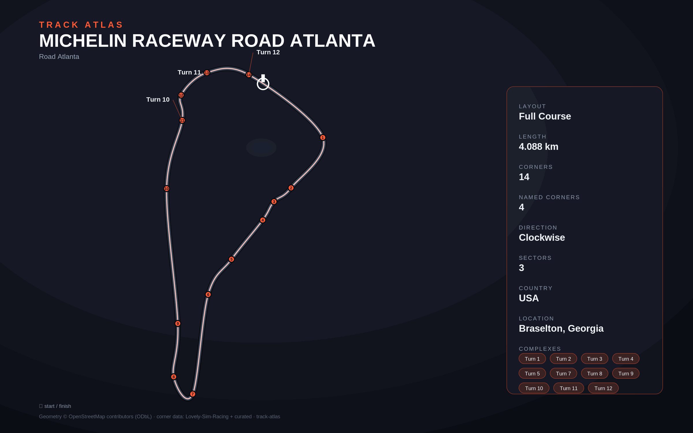

# Michelin Raceway Road Atlanta

- **Layout**: Full Course (4088 m, clockwise)
- **Series**: imsa
- **Corners**: 14 (14 named); OSM name-match 1/14, 0 placed by centerline lap-fraction
- **Geometry**: stitched from `highway=raceway` ways in the bbox (no OSM route relation found)
- **Corner metadata**: Lovely-Sim-Racing `iracing/roadatlanta-full.json`

## Surface

- Edges measured from USDA NAIP (2023-10-22, 0.6 m): width median 12.5 m
  (p05 11.9, p95 17.2), edges seen on 73% (left) / 77% (right) of the lap,
  relative precision 0.25 m, absolute accuracy 4 m CE95 (NAIP contract).
- Largest bridged (unseen) spans: left edge 0.363-0.401 (after T6), right
  edge 0.539-0.585 (back straight) and 0.789-0.822 (approach to T10A); the
  rest are short gaps (shadow, kerbs, pit merges). All are listed in
  `unseen_spans`.
- Corner directions corrected from the measured curvature (the lap is
  clockwise): T1, T3, T10B and T12 were marked left, T2 right.
- No curvature peak near t8 or t10 (back straight); unnamed right-hand peaks
  at 0.256 (esses) and 0.471 (the run down to T7).

## Known gaps

- Official corner names not yet layered in (colloquial layer from Lovely only).
- No OSM route/circuit relation; outline quality depends on bbox way coverage.
