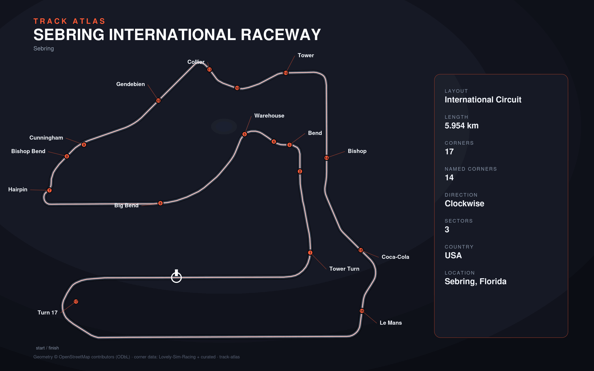

# Sebring International Raceway

- **Layouts**: two series-specific configurations of the International Circuit
  (5954 m, clockwise), sharing the same geometry and corners:
  - `wec` — pit entry/exit 0.72 / 0.82 (from Lovely)
  - `imsa` — pit entry/exit 0.705 / 0.835
- **Series**: imsa, wec
- **Corners**: 17 (8 named); OSM name-match 3/17, 14 placed by centerline lap-fraction
- **Geometry**: OSM relation [7003292](https://www.openstreetmap.org/relation/7003292) centerline
- **Corner metadata**: Lovely-Sim-Racing `lmu/sebring-international-raceway.json`
- **Corner curation**: shared by both layouts via the `"*"` block in `overrides.json`

## Known gaps

- **The IMSA pit entry/exit values (0.705 / 0.835) are SPECULATIVE** — placeholders
  demonstrating the two-layout model. They need verification against an
  authoritative IMSA source; only the fact that IMSA and WEC use different pit
  in/out is known, not the exact lap fractions.
- Official corner names only partially layered in (driver layer from Lovely).
