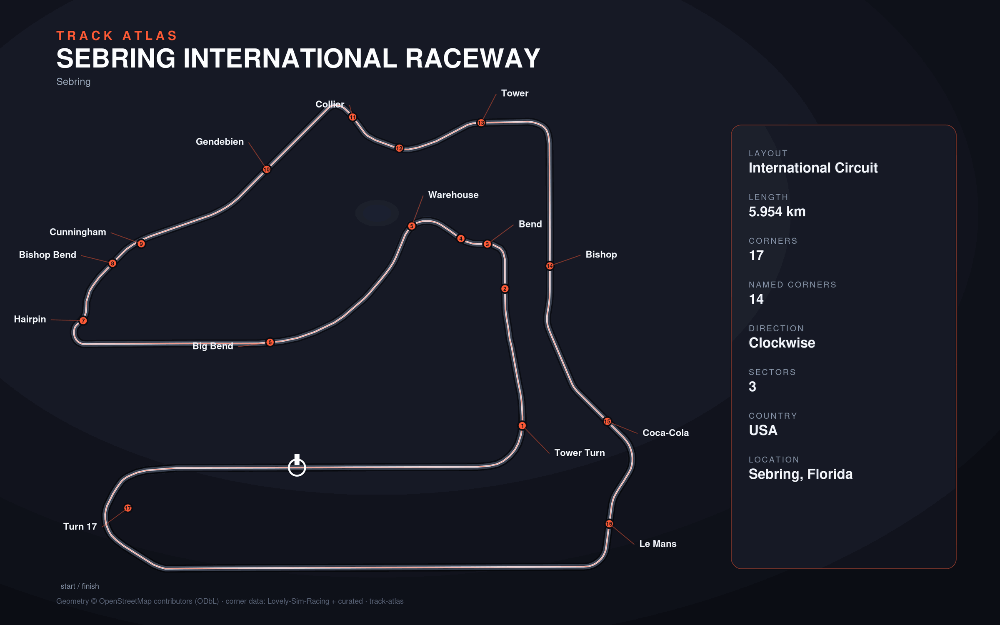

# Sebring International Raceway

- **Layouts**: two series-specific configurations of the International Circuit
  (5954 m, clockwise), sharing the same geometry and corners:
  - `wec` — pit entry/exit 0.9675 / 0.0608
  - `imsa` — pit entry/exit 0.9675 / 0.0608
- **Series**: imsa, wec
- **Corners**: 17; shared curation in the `"*"` block of `overrides.json`
- **Geometry**: OSM relation [7003292](https://www.openstreetmap.org/relation/7003292) centerline
- **Pit geometry**: pit-lane endpoints projected from the OSM `Pit Lane` way to
  the lap centerline.
- **Corner metadata**: Lovely-Sim-Racing `lmu/sebring-international-raceway.json`,
  corrected with OSM named-way positional evidence.

## Curation notes

Evidence: measured midline curvature (`raw/surface-*.json`), the OSM relation
centerline and its named corner ways. Eleven unnamed peaks are reviewed in
`overrides.json` `"*".surface_review`, shared by both layouts because they
use the same geometry:

- Extra lobes inside a named OSM corner way, reviewed as `part_of_corner`:
  - Hairpin exit: 0.3488, 0.3594
  - Collier: 0.4897, 0.5179
  - Gendebien exit: 0.7051
  - Sunset Bend: 0.8975, 0.9155 and 0.9372, around the marked R46 apex at
    0.9251
  - T1's second lobe: 0.097
- 0.1014 R69 is an artefact. The centerline bends left there and the right
  edge is unseen.
- 0.6566 L70 is a real bend between Bishop Bend and Gendebien (the
  centerline bends too) but is not one of the circuit's 17 numbered turns.

Not changed: T2 (-77 m), T8 Fangio (-49 m) and T17 (-30 m) still carry legacy
marker offsets. Their matched peaks are the right corners.

## Known gaps

- Several numbered Sebring turns intentionally remain number-only where we do
  not have a reliable driver/common name.
- If IMSA/WEC publish event-specific pit timing-loop fractions, those can become
  generated point layers; the current physical pit in/out points are geometry-derived.
