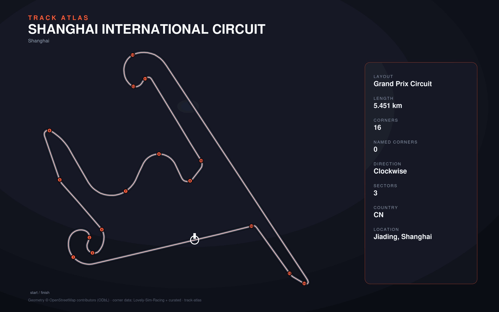

# Shanghai International Circuit

- **Layout**: Grand Prix Circuit (5451 m, clockwise)
- **Series**: f1
- **Corners**: 16 (16 named); OSM name-match 0/16, 0 placed by centerline lap-fraction
- **Geometry**: OSM relation [2094941](https://www.openstreetmap.org/relation/2094941) centerline
- **Corner metadata**: Lovely-Sim-Racing `f12025/shanghai.json`

## Known gaps

- Official corner names not yet layered in (colloquial layer from Lovely only).
