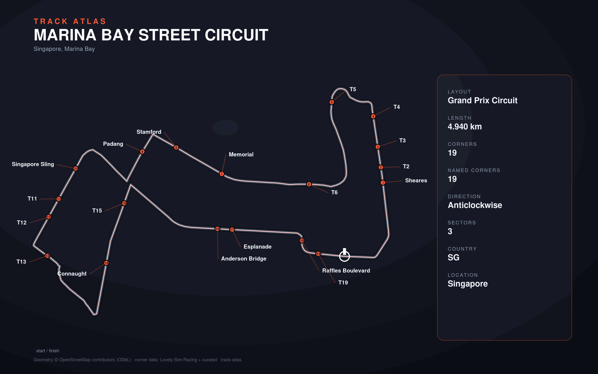

# Marina Bay Street Circuit

- **Layout**: Grand Prix Circuit (4940 m, anticlockwise)
- **Series**: f1
- **Corners**: 19 (19 named); OSM name-match 0/19, 19 placed by centerline lap-fraction
- **Geometry**: OSM relation [421263](https://www.openstreetmap.org/relation/421263) centerline
- **Corner metadata**: Lovely-Sim-Racing `f12025/singapore.json`

## Known gaps

- Official corner names not yet layered in (colloquial layer from Lovely only).
