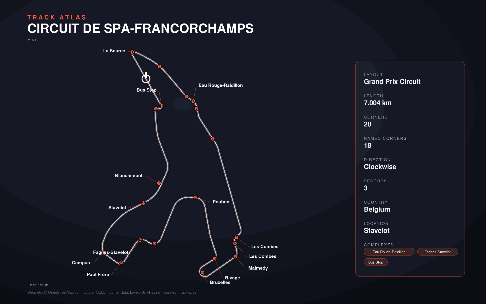

# Circuit de Spa-Francorchamps

- **Layout**: Grand Prix Circuit (7004 m, clockwise)
- **Series**: wec, elms, f1
- **Corners**: 20 (10 named); OSM name-match 8/20, 12 placed by centerline lap-fraction
- **Geometry**: OSM relation [284560](https://www.openstreetmap.org/relation/284560) centerline
- **Corner metadata**: Lovely-Sim-Racing `lmu/circuit-de-spa-francorchamps.json`

## Known gaps

- Official corner names not yet layered in (colloquial layer from Lovely only).
