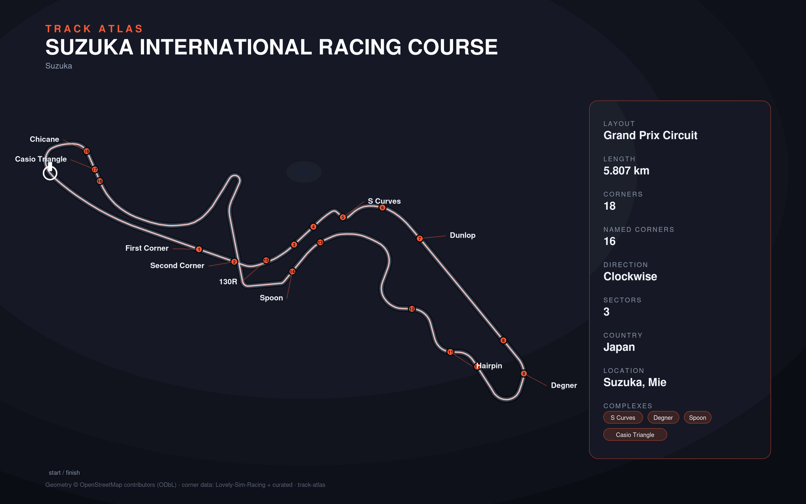

# Suzuka International Racing Course

- **Layout**: Grand Prix Circuit (5807 m, clockwise)
- **Series**: f1
- **Corners**: 18 (18 named); OSM name-match 1/18, 17 placed by centerline lap-fraction
- **Geometry**: OSM relation [284570](https://www.openstreetmap.org/relation/284570) centerline
- **Corner metadata**: Lovely-Sim-Racing `f12025/suzuka.json`

## Known gaps

- Official corner names not yet layered in (colloquial layer from Lovely only).
