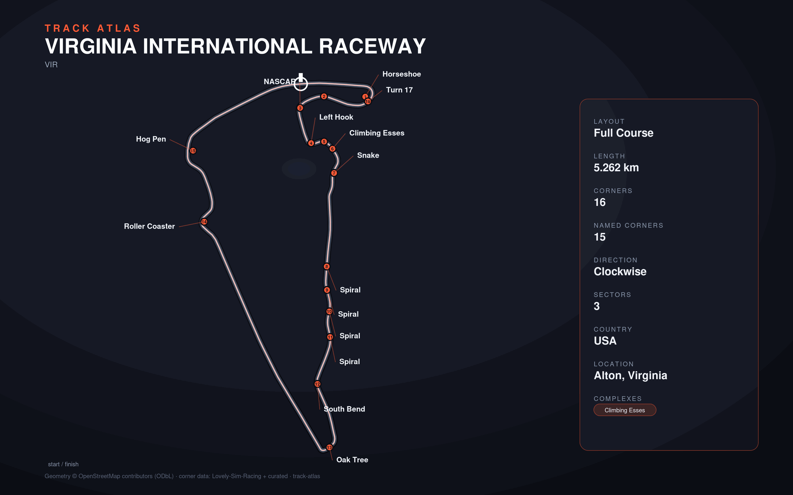

# Virginia International Raceway

- **Layout**: Full Course (5262 m, clockwise)
- **Series**: imsa
- **Corners**: 16 (16 named); OSM name-match 7/16, 0 placed by centerline lap-fraction
- **Geometry**: OSM relation [15765486](https://www.openstreetmap.org/relation/15765486) centerline
- **Corner metadata**: Lovely-Sim-Racing `iracing/virginia-2022-full.json`

## Known gaps

- Official corner names not yet layered in (colloquial layer from Lovely only).
