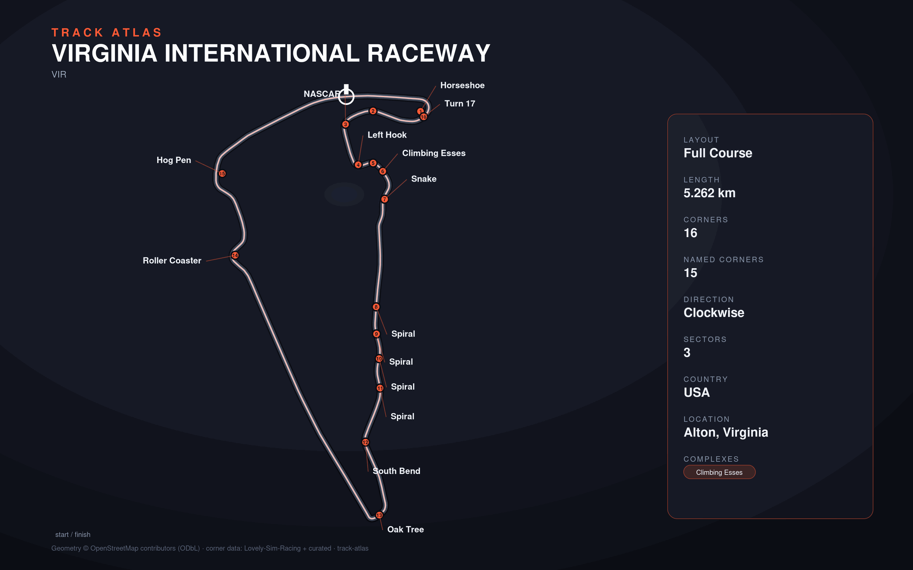

# Virginia International Raceway

- **Layout**: Full Course (5262 m, clockwise)
- **Series**: imsa
- **Corners**: 17, curated with `lap.corners([...])` in `track.py`
- **Geometry**: OSM relation [15765486](https://www.openstreetmap.org/relation/15765486) centerline
- **Corner metadata**: Lovely-Sim-Racing `iracing/virginia-2022-full.json`

## Known gaps

- Turn numbering is the geometry order of the 17 distinct bends; no official
  VIR turn map was used, so T5-T7 and T14-T17 numbers are the least certain.
- Lap origin is pinned at the previous OSM-alignment origin, not surveyed.

## Curation notes

Evidence: NAIP-measured midline curvature (`raw/surface-gp.json`), the OSM
relation centerline and the named OSM raceway ways, Lovely
`iracing/virginia-2022-full.json` ranges (no apex markers). Every corner now
sits within 1 m of its measured peak.

The Lovely-derived list had eight declared directions against the geometry,
markers that matched wiggles or no peak at all, and names in the wrong
places ("Climbing Esses" on two rights, an invented "Spiral"). Replaced with:

| # | name | dir | marker | measured peak | was |
|---|---|---|---|---|---|
| 1 | Horseshoe | R | 0.0735 | R35, -119 deg (+ R50 second apex 0.0838) | marker 42 m off |
| 2 | | L | 0.1311 | R91, +40 deg | |
| 3 | NASCAR Bend | L | 0.1556 | R45, +72 deg; OSM NASCAR Bend 0.149-0.163 | declared right, matched a R345 wiggle at 0.1651 |
| 4 | Left Hook | L | 0.1946 | R26.5, +90 deg; OSM Left Hook 0.190-0.201 | |
| 5 | | R | 0.2075 | R32, -65 deg | named Climbing Esses |
| 6 | | R | 0.2332 | R41.5, -55 deg (Lovely "Turn 5a" 0.226-0.243) | declared left, named Climbing Esses |
| 7 | Snake | L | 0.2681 | R77, +24 deg (+ R75 lobe 0.2448); OSM Snake 0.226-0.270 | |
| 8-11 | Climbing Esses | L R L R | 0.3535 / 0.3786 / 0.3961 / 0.4100 | R134 / R124 / R100 / R114, +-17-26 deg each | directions alternated the wrong way (R L R L), named Spiral |
| 12 | South Bend | L | 0.4551 | R75.5, +38.5 deg; OSM South Bend 0.450-0.460 | declared right |
| 13 | Oak Tree | R | 0.5309 | R24, -100 deg (+ R47 first apex 0.5139); OSM Oak Tree Curve 0.523-0.536 | declared left |
| 14 | Roller Coaster | R | 0.7803 | R33, -100 deg; OSM Roller Coaster 0.772-0.796 | |
| 15 | Roller Coaster | L | 0.7964 | R60, +69 deg | missing (unnamed peak) |
| 16 | Hog Pen | L | 0.8392 | R82, +37 deg; OSM Hog Pen 0.837-0.890 | marker 138 m off |
| 17 | Hog Pen | R | 0.8547 | R49, -64 deg (+ R80 0.8801) | "Turn 17" at 0.0835, copied from Lovely's duplicate "Turn 18" (same range as the Horseshoe), no peak |

The reviewed unnamed peaks (0.0838, 0.2448, 0.5139) are second lobes of T1,
T7 and T13 (`lap.unnamed(...)` in `track.py`).
