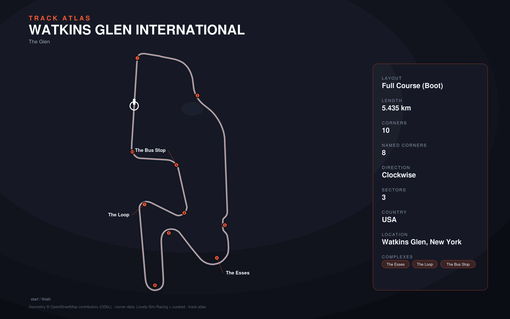

# Watkins Glen International

- **Layout**: Full Course (Boot) (5435 m, clockwise)
- **Series**: imsa
- **Corners**: 10 (10 named); OSM name-match 6/10, 0 placed by centerline lap-fraction
- **Geometry**: OSM relation [4872324](https://www.openstreetmap.org/relation/4872324) centerline
- **Corner metadata**: Lovely-Sim-Racing `iracing/watkinsglen-2021-fullcourse.json`

## Known gaps

- Official corner names not yet layered in (colloquial layer from Lovely only).
