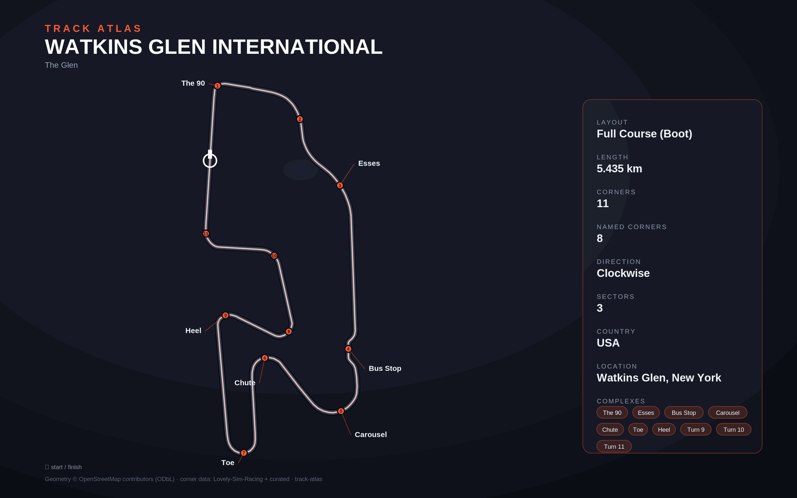

# Watkins Glen International

- **Layout**: Full Course (Boot) (5435 m, clockwise)
- **Series**: imsa
- **Corners**: 11, curated `replace_corners` in `overrides.json`
- **Geometry**: OSM relation [4872324](https://www.openstreetmap.org/relation/4872324) centerline
- **Corner metadata**: Lovely-Sim-Racing `iracing/watkinsglen-2021-fullcourse.json`

## Known gaps

- Official corner names not yet layered in (colloquial layer from Lovely only).

## Curation notes

Evidence: NAIP-measured midline curvature (`raw/surface-gp.json`), the OSM
relation centerline and the named OSM raceway ways (fractions below are lap
fractions on the emitted centerline). Unnamed-peak verdicts live in
`overrides.json` `gp.surface_review`.

| corner | problem | evidence | fix |
|---|---|---|---|
| T7 Toe | declared left | midline R56 m, -177 deg (right), 0.6027, inside OSM "The Toe" 0.586-0.633 | direction right |
| T8 Heel | declared left, so it matched a R213 left lobe 104 m late | real Heel R44 m, -119 deg (right) at 0.7315, inside OSM "The Heel" 0.725-0.754 | direction right, marker 0.74 -> 0.7315 |
| T9 | declared right | midline R52 m, +128 deg (left) at 0.8074, inside OSM "The Boot" 0.785-0.808 | direction left |
| T2 / T3 Esses | markers 102 m / 74 m off their peaks | L R145 at 0.1686, R R148 at 0.2066 | markers moved to the peaks |
| T4 Inner Loop | marker 84 m after the entry apex | R R47 at 0.3507 (chicane R-L-L-R) | marker 0.366 -> 0.3507 |
| T11 | marker 75 m late | R R57, -93 deg at 0.9228 | marker 0.9365 -> 0.9228 |

Unnamed peaks: 0.3604 L, 0.3750 L, 0.3849 R are the rest of the Inner Loop
chicane; 0.4089 R and 0.4443 R are the Outer Loop's other apexes (OSM Outer
Loop 0.392-0.459); 0.5201 L is the Chute's second apex. Artefacts: 0.1173 R49
(both edges bridged, OSM centerline R204), 0.7549 R78 (-11 deg, neither edge
seen), 0.9622 L / 0.9662 R (+-20 deg pair at the pit merge, OSM centerline
straight). The remaining warnings are the low seen fractions (41 % / 51 %):
tree shadow and the Esses/Boot run-off, a surface measurement limit.
