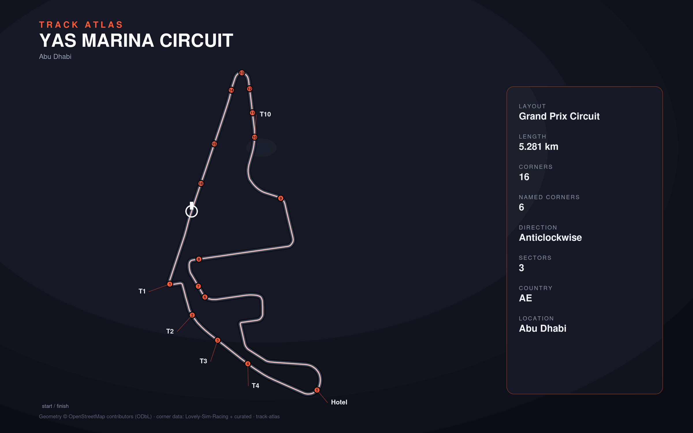

# Yas Marina Circuit

- **Layout**: Grand Prix Circuit (5281 m, anticlockwise)
- **Series**: f1
- **Corners**: 16 (16 named); OSM name-match 0/16, 16 placed by centerline lap-fraction
- **Geometry**: OSM relation [11378665](https://www.openstreetmap.org/relation/11378665) centerline
- **Corner metadata**: Lovely-Sim-Racing `f12025/abu-dhabi.json`

## Known gaps

- Official corner names not yet layered in (colloquial layer from Lovely only).
